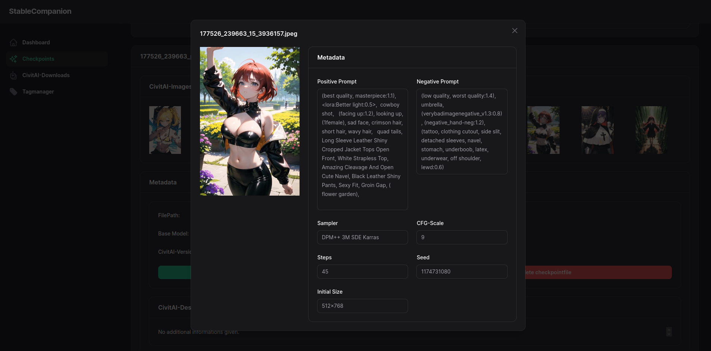

# StableCompanion (SC)

## IMPORTANT: This project is still "work in progress"!

## About
StableCompanion is a side-software meant to accompany an already installed instance of A1111s-WebUI.
It was build out of the problem that there are maaaaany extensions out there, but none of them did quite what I wanted in some cases.
For example: There is no good (as in "easy") extension or script to test one prompt against all installed models.  
Plus - there is no good extension there for model-, LoRA- or Embedding-management. So my harddrive becomes 
cluttered with all those cool models where I have no clue on how to use them properly. Yes - there are docs, but who can memorize those?

## Important premise
I've build StableCompanion for myself as part of my "recreational programming". It has no intention to specifically fit your usecases, but mine. Hopefully you find it usefull aswell. :)  
And before someone asks "Why a side-software written in PHP? Couldn't you just wrote a normal A1111-Extension like any normal person out there?" - Well..
I could... But that would imply to learn Python and stuff, which I don't have the time right now. But I know PHP, I know Laravel and how to do stuff with it. 
So take it, or leave it. :)  
Plus - technically you can use StableCompanion to also manage your models for ComfyUI, InvokeAI and whatnot. The toolbox will only depend on A1111.

## Some Screenshots
<figure class="image">
<figcaption>Overview of checkpoints:</figcaption>
  
</figure>
<figure class="image">
<figcaption>Detailview of a checkpoint:</figcaption>
  
</figure>
<figure class="image">
<figcaption>CivitAI-Example-Image with checkpointfile in background:</figcaption>
  
</figure>

## Working Features
### Checkpoints, LoRAs, Embeddings
  - Management of existing models (CRUD)
  - Import models from CivitAI
  - Link exisiting files to a CivitAI-Model
  - Update models from CivitAI
  - Preview-Images for A1111

## Planned Features
- Toolbox for testing and playing around
- Build prompts and store them
- include Hypernetworks as importable Models (depends on feedback..)

## Setup
### Prerequisites
- OS: Does not matter (I am running and testing SC on Ubuntu 22.04.)
- installed Docker-Engine (https://docs.docker.com/engine/install/) and docker compose (note: docker compose can be installed on Windows aswell -> see https://www.ionos.com/digitalguide/server/configuration/install-docker-compose-on-windows/)
- Installed and running instance of A1111-WebUI with the following parameters:
  - `--api` in launch-commands
  - Following extensions installed (right now, they are not needed, but they will be in the future!):
    - Adetailer (https://github.com/Bing-su/adetailer)
    - Regional Prompter (https://github.com/hako-mikan/sd-webui-regional-prompter)
    - ControlNet (https://github.com/Mikubill/sd-webui-controlnet)
### Setup
  1. Clone this repo
  2. Cd into the docker-directory and copy the docker-compose.yml.original to docker-compose.yml
  3. Modify the newly created docker-compose.yml to your need
     1. Set the volumes accordingly (should be self-explaining inside the file - if you need help, see https://docs.docker.com/storage/volumes/#use-a-volume-with-docker-compose)
        - IMPORTANT: DO __NOT__ POINT THIS TO A SYMLINK! If you've symlinked your directories for A1111, please enter the destination-path here and not the symlink! Docker can't work with those! 
     2. Set the URL accordingly -> if you run A1111 and SC on your local machine, just leave it be. If you are in a network and want SC to be reachable change it to http://<IP OR COMPUTERNAME>:7861
  4. Run `docker compose build` and wait for it to finish.
  5. Fireup A1111-WebUI (if not already up)
  6. Run `docker compose up` (if you have the composer-plugin installed, that should work fine aswell) inside the docker-directory and go to http://localhost:7861 - Notice: You can run SC in the background by running `docker compose up -d`, but I recommend running it in foreground on the first start.
  7. The first run might take a bit, since composer has to install all dependencies - just wait a bit until you read `INFO exited: startup (exit status 0; expected)` - Notice: If you read `INFO gave up: startup entered FATAL state, too many start retries too quickly` on start - that's nothing to worry about. The startup-script bites itself a bit with supervisor. As long as php-fpm, nginx and aria are running you are fine. :)
  9. Open SC and visit the Settings-Page
     1. If you install SC alongside A1111 (and haven't changed the port) you can leave the URL be.
     2. However - if you have changed the port of A111 or run SC somewhere else in your network (possible if A1111 and SC use a NAS for files) please restart the SC-Container once you change the Setting. (Otherwise there will be problems with detections and such.)

### Update
  1. cd into the repo-folder
  2. if you have SC running in the background, run `docker stop companion_frontend`
  3. Run `git pull` inside the repo-folder
  4. Cd into the docker-directory and run `docker compose build`
  5. Run `docker compose up` or `docker compose up -d` 

### Usage
  There are some "rules" you should follow when using StableCompanion. Here they are:
- SC is meant to run on your local machine! That is the reason why I've removed any login- and logout-resources and there is no password. If you want to run SC on a server or in a LAN with multiple people having access - create a new .htpasswd-file within the /src-directory and whenever you need to run `docker compose build`, run it like this: `docker compose build --build-arg PASSNGINX="1"`.
- Do NOT rename files within the checkpoints-, loras- or embedding-directory (that also includes changing file-extensions)! SC will detect them as "new" files which will lead to duplicates in the database! There is a feature in SC for doing that!
- SC does create the folders "sd" and "xl" inside your checkpoint-, lora- and embedding-volumes. This is done to provide a file-separation for regular models and XL-stuff. That behaviour might lead to confusing lists inside A1111 or whatever you are using. 
- When you import a checkpoint, lora, or embedding from CivitAI - SC will try to keep the original-filename. If the model-uploader gave the same filename multiple times, SC will append the current timestamp to the filename. This might change prompting behavior!
- Within each folder (checkpoints, loras, embeddings) you can create a directory with the name "no_scan" - StableCompanion scans your files recursively, but EXPLICITLY ignores that directory. In there you can put all your files that are still in training or should not be used by StableCompanion at all.
- All requests against the CivitAI-API are beeing cached for one hour or until the container is restarted. I just try to play nice here - so please follow suit. If you wanna look for updates - there are buttons for that you can hit once every hour.
- RTFM and READ THE TEXTS ON SCREEN! I've tried to make you aware of what is happening in every step, so please read what is on screen and make conscious clicks. :)
- When you do some multistep-process and click on "Submit" it can seem that nothing happens. Just wait a bit! I had to do some wizardry to get the UI I wanted, but it is not very responsive in some instances. :) When you think "There is really nothing happening for the last 10 seconds..." - click it again.
- Sometimes, when you download multiple files at once (max. 5) it's possible that they show up as 100%-done in the downloads tab on the first seconds of downloading. This is due to a bug in Aria2. Just wait a bit (10 seconds) if you are unsure.

## PAQ
Since there are no "Frequently asked questions" yet I'm doing a "Possible asked questions." :)
- All the talk about "Linking to CivitAI" inside the software - do you send data there? -> Nope. Everything runs locally on your machine. There are downloads, but no uploads!
- Is there a way to import a specific image from CivitAI? -> Unfortunately the CivitAI-API is borked when it comes to this and so far no one was able to tell me how that should work. I get empty results when I try `https://civitai.com/api/v1/images?postId=123`
- Can I import all the images of a checkpoint/lora/embedding? -> Nope. StableCompanion relies on the CivitAI-API and that gives me only 10 images max. Plus - see above.
- When I inspect an example-image - the modelname looks weird and is "unknown" sometimes. Can't you just link the used checkpoint? -> CivitAI only tells me a filename without an extension. You have to search the model manually. The only exceptions to that are checkpoints - if the image is inside a checkpoint, it should have been made using that checkpoint.
- You've implemented the preview-images, but A1111-WebUI also supports json-files with meta-data. Why don't you do those? -> I don't do them because all the info is in SC and SC is meant to be opened alongside A1111. If you really feel that should be a thing, then make a PR. :)
- Sometimes Checkpoints and LoRAs have usage tips (like Clip Skip) - where can I find those in SC? -> Unfortunately nowhere. The CivitAI-API does not give me those. For now - I recommend keeping the model-tab open until the model is imported and put those in your user-notes.
- Will you optimize this for mobile-devices? -> Well - I will not. If you really need that, feel encouraged to make a PR. :)
- Whenever I import something from CivitAI, the number of downloads in the left menu does not go up. Actually - it does not change at all until I reload or change the page! Why? -> That is one of the weak points of Filament. AFAIK there is no solution to that right now.
- Will you support downloads from Huggingface or somewhere else aswell? -> Not for now. If you have something from Huggingface or somewhere else, I would recommend to just download the file and put it wherever it belongs on your filesystem.
- When will feature XYZ be done? -> Well - I do this project just-for-fun and recreation. I still have a family, a job and a life to look after - so I only work on this when I have time.

## Contributing
If you have a cool idea, feel free to create a fork and a PR-followup. Codingstylewise I do not enforce any strict rules - but I want descriptive function- and variablenames. $x and such are only allowed in counters in a for-loop.  
I will try to review your PR as soon as I find the time.

## Troubleshooting
### Help - all Image-Files seem to be broken!
Are you sure you set the URL within the docker-compose.yml correctly? Nope? Happened to me aswell. :) Just correct it and run SC again.
### I'm getting an Exception `Something went wrong connecting to A1111!`
In that case make sure that A1111 is up and running. Additionally check the A1111-URL-Key in your Settings. If you have to change it, please restart the SC-container after your change.

## Legal and stuff
I'm releasing StableCompanion "as is" and take no responsibility of what you are doing with it. Please follow your local laws and respect the terms of the models and files you are downloading and managing.  
Under no circumstances are you allowed to redistribute StableCompanion in any context!  
If you use SC or parts of it for your own project/software/what-not: Just drop a link to this repo and my Github-Profile in there for people to find.